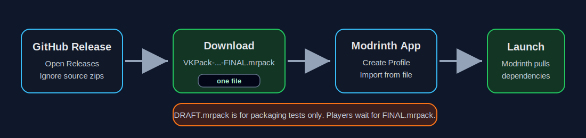

# VKPack

VKPack is the public source and release workspace for the client pack. It contains the parts that make the pack ours: KubeJS scripts, balance/data edits, selected configs, generated GrindingGear visuals, manifests, and first-party GrindingGear source.

This repo follows a clean rule: **players install a `.mrpack`; maintainers edit the repo.** Third-party mod jars are not committed to GitHub.

## Downloads

| Goal | Download From GitHub Releases | Use It For |
|---|---|---|
| Play VKPack | `VKPack-...-FINAL.mrpack` | Import into Modrinth App and launch. |
| Test packaging | `VKPack-...-DRAFT.mrpack` | Maintainers/testers only; missing `23` unresolved download references right now. |
| Inspect or contribute | `VKPack-GitHub-Source-...zip` or clone the repo | KubeJS/config/docs/source work. Not playable by itself. |
| Publish/update GrindingGear | `GrindingGear-...jar` | First-party release asset if the pack/server requires it. |

**Do not download GitHub's automatic `Source code.zip` to play.** It is not a Modrinth profile and intentionally does not contain third-party mod jars.

Start here: [Visual Player Setup Tutorial](docs/PLAYER_SETUP_TUTORIAL.md).

## Player Install

Use the GitHub Release asset named `VKPack-...-FINAL.mrpack` once it is published.

1. Open the GitHub **Releases** page.
2. Download `VKPack-...-FINAL.mrpack`.
3. Open Modrinth App.
4. Choose **Create Profile** / **Import from file**.
5. Select the `.mrpack` file.
6. Let Modrinth download the referenced mods and install the overrides.
7. Launch VKPack.

Full player instructions are in [INSTALL.md](INSTALL.md).

## Current Release Status

The current generated pack file is `VKPack-2026-06-30-resolved-only-DRAFT.mrpack`. It is useful for testing, but it is **not final one-click install** yet.

Why: `23` files did not resolve through Modrinth's public hash lookup. They are listed in [manifest/MANUAL_DOWNLOADS_REQUIRED.md](manifest/MANUAL_DOWNLOADS_REQUIRED.md). To make the final one-click `.mrpack`, each unresolved file must be handled by one of these routes:

- replace it with a Modrinth-hosted equivalent,
- add a legal direct download URL in local maintainer file `manifest/manual-downloads.local.json`, or
- remove/replace the mod if automated redistribution/download is not allowed.

## What Is Included

- `overrides/kubejs` - gameplay scripts, recipes, SilentGear/Apotheosis data, generated assets, and pack integration edits.
- `overrides/config` - curated pack configs, with local credentials, caches, and binary update jars excluded.
- `overrides/resourcepacks/GrindingGear Visual Atlas` - first-party generated visuals for custom material work.
- `grindinggear` - source/docs for first-party GrindingGear work. Build outputs live in GitHub Releases, not git history.
- `manifest` - active mod list, resolved Modrinth files, manual download blockers, and override hashes.
- `tools` - audit/build/publish scripts for transparent releases.

## What Is Not Included

- third-party `mods/` jars,
- `saves/`, `logs/`, `crash-reports/`, `screenshots/`, backups, caches, and local server data,
- generated password/web config like `config/resourceful-config-web.json`,
- binary update caches such as `config/Veinminer/update/*.jar`.

## Maintainer Flow

1. Edit KubeJS/config/source in this repo.
2. Run `tools/audit_release.ps1`.
3. Run `tools/validate_installability.ps1`.
4. Resolve every entry in `manifest/MANUAL_DOWNLOADS_REQUIRED.md`.
5. Build a final `.mrpack` with `tools/build_final_mrpack.ps1`.
6. Publish the repo/release with `tools/publish_github_release.ps1`.

See [docs/MAINTAINER_RELEASE_FLOW.md](docs/MAINTAINER_RELEASE_FLOW.md).

## License

Pack-specific scripts, docs, and first-party generated configs in this repo are released under the license in `LICENSE`. Third-party mods, mod assets, and external resource/shader packs remain under their own licenses.

