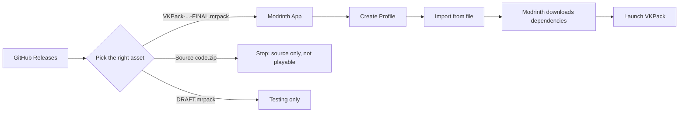
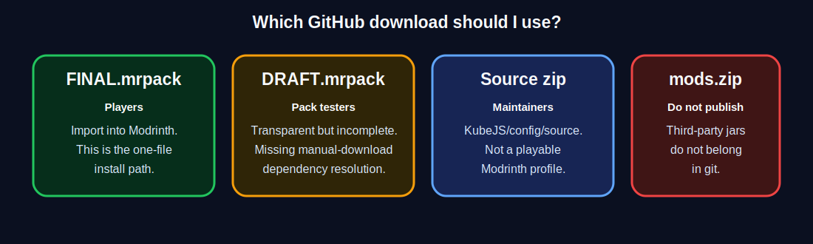

# Visual Player Setup Tutorial

This guide is for players coming from GitHub who just want VKPack running in Modrinth.

## Setup Map




## Step 1: Open The Releases Page

On GitHub, use the **Releases** link on the right side of the repo page, or open the latest release from the top of the README once the repo is published.

Look for release assets. Assets are the downloadable files attached to a release.

## Step 2: Pick The Right Download



| If you see this | What it means | Should a player use it? |
|---|---|---|
| `VKPack-...-FINAL.mrpack` | Complete Modrinth import file | Yes |
| `VKPack-...-DRAFT.mrpack` | Packaging test file | No, unless testing |
| `VKPack-GitHub-Source-...zip` | Source snapshot | No, source only |
| `GrindingGear-...jar` | First-party mod artifact | No, not by itself |
| GitHub `Source code.zip` | Auto-generated repo archive | No, not playable |

Current state: the repo has a draft `.mrpack`, but not a final one yet. The final one is blocked by `23` unresolved manual-download entries listed in `manifest/MANUAL_DOWNLOADS_REQUIRED.md`.

## Step 3: Import Into Modrinth

1. Open **Modrinth App**.
2. Click **Create Profile**.
3. Choose **Import from file**.
4. Select `VKPack-...-FINAL.mrpack`.
5. Wait for Modrinth to download the dependencies.
6. Launch the new VKPack profile.

You should not need to copy KubeJS, configs, resource packs, or jars by hand. The `.mrpack` handles that.

## Step 4: First Launch Checks

After import, check these before joining the server:

| Check | Expected |
|---|---|
| Minecraft version | `1.21.1` |
| Loader | `NeoForge 21.1.233` |
| KubeJS startup | No startup-script error screen |
| Server join | No registry/missing mod mismatch |
| Shader setup | Optional; enable after first successful launch |

## Common Mistakes

| Problem | Likely Cause | Fix |
|---|---|---|
| Modrinth will not import the file | Downloaded source zip instead of `.mrpack` | Download `VKPack-...-FINAL.mrpack` from Releases |
| Missing mod errors | Used draft pack or incomplete manual setup | Wait for final release or install listed manual dependencies |
| KubeJS mismatch with server | Client/server releases do not match | Use the same release tag as the server |
| Game launches but cannot join server | Server pack has different mod/config/KubeJS set | Server owner should deploy the matching release |

## For People Using Git

Git is for maintaining the pack, not for installing it as a normal player.

```powershell
git clone https://github.com/YOUR_USERNAME/VKPack.git
cd VKPack
powershell -NoProfile -ExecutionPolicy Bypass -File .\tools\validate_installability.ps1
```

If `validate_installability.ps1` says **DRAFT only**, the repo is not ready to produce a final one-click `.mrpack` yet.

## What A Final Release Looks Like

A good final GitHub release should have at least:

```text
VKPack-2026.06.30-FINAL.mrpack      <- players download this
VKPack-GitHub-Source-2026-06-30.zip <- maintainers inspect this
GrindingGear-1.0.0+mc1.21.1.jar     <- first-party artifact if required
RELEASE_AUDIT.json                  <- transparency/audit record
```

Players only need the `FINAL.mrpack`.

