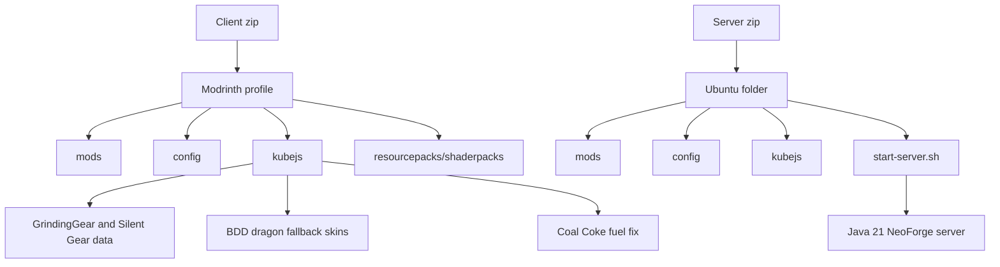

# Gigani Setup, Specs, and Operations

This guide is written for the current heavy NeoForge 1.21.1 build of Gigani. It favors stability, transparent setup, and public-server operation over fantasy numbers.

## Client hardware tiers

| Tier | CPU: Intel side | CPU: AMD side | NVIDIA GPU | Radeon GPU | RAM | Client heap | Expected settings |
|---|---|---|---|---|---:|---:|---|
| Minimum playable | Core i5-12400 / i5-13400 | Ryzen 5 5600 / 7600 | GTX 1660 Super / RTX 3050 | RX 6600 / RX 7600 | 32 GB | 8-10 GB | 8-10 chunks, no heavy shaders |
| Comfortable | Core i5-13600K / i7-12700K | Ryzen 7 5800X3D / 7700 | RTX 3060 Ti / RTX 4060 | RX 6700 XT / RX 7600 XT | 48-64 GB | 12-16 GB | 12-18 chunks, light shaders |
| Recommended | Core i7-14700K class | Ryzen 7 7800X3D class | RTX 4060 Ti / RTX 4070 | RX 7800 XT | 64 GB | 16-20 GB | 16-22 chunks, shaders reasonable |
| High shader headroom | Core i9-14900K class | Ryzen 9 7950X / X3D class | RTX 4070 Ti Super / RTX 4080 | RX 7900 XT / XTX | 64-96 GB | 20-24 GB | 22 chunks, strong shaders |

Notes:

- More heap is not automatically faster. Too much client heap can make garbage collection and stutter worse.
- GPU usage is mainly from rendering, shaderpacks, high resolution, and draw distance. KubeJS, recipes, AI, mobs, and world ticking are CPU/server-side.
- On a server, the server's view distance caps what the client can actually receive. Client `renderDistance:22` helps singleplayer and high-cap servers, but the public server is intentionally set to 12 view distance.

## Server sizing matrix

| Players | Practical layout | CPU target | RAM target | Server Xmx | View / sim | Notes |
|---:|---|---|---:|---:|---|---|
| 5 | One machine | 6c/12t modern desktop CPU | 32 GB | 16G | 12 / 6 | Pregenerate the spawn region. |
| 10 | One strong machine | 8c/16t high clock | 48-64 GB | 24G | 12 / 5 | Keep farms sane and use Spark after launch. |
| 15 | One strong machine | 8-12 fast cores | 64-96 GB | 32G | 12 / 5 | Chunky pregeneration becomes important. |
| 25 | Starbook/high-memory host | 12-16 modern threads, high single-core speed | 96-128 GB | 64-84G | 12 / 5 | Current target. Use Chunky, claims, and scheduled restarts. |
| 50 | Dedicated desktop/server | 16+ high-clock cores | 128-192 GB | 84-96G | 10 / 4 | Consider splitting dimensions or using a proxy network. |
| 100 | Networked servers | Multiple high-clock nodes | 128 GB+ per node | 48-84G per node | 8-10 / 4 | One modded NeoForge instance is not realistic. Use Bungee/Velocity-style topology where possible. |
| 250 | Multi-server network | Many nodes | Per-node sizing | Per-node sizing | 6-8 / 3-4 | Requires sharding, rules, pregen, backups, monitoring, and staff tooling. |
| 1000 | Service architecture | Many nodes plus proxy and database/services | Per-node sizing | Per-node sizing | 6 / 3 | Not a single Minecraft server. Treat it as an MMO-style network project. |

## Current public server defaults

```properties
max-players=25
view-distance=12
simulation-distance=5
online-mode=true
enable-rcon=true
spawn-protection=0
```

## Current server Java defaults

```bash
GIGANI_XMS=24G
GIGANI_XMX=84G
GIGANI_SOFT_MAX_HEAP=64G
GIGANI_CPU_PERCENT=85
```

The launcher uses Java 21 with ZGC and `-XX:ActiveProcessorCount` based on `GIGANI_CPU_PERCENT`.

## Measuring actual hardware use

Client on Windows:

- CPU: Task Manager Performance tab, or Resource Monitor.
- GPU: Task Manager Performance -> GPU -> watch the 3D engine, not just copy/video encode.
- NVIDIA: `nvidia-smi dmon` or the NVIDIA App overlay.
- AMD: AMD Software Adrenalin metrics overlay.
- Minecraft-side: Spark profiler and F3 frame/tick graphs.

Server on Ubuntu:

```bash
htop
free -h
iostat -xz 1
./rcon.sh "spark profiler --timeout 120"
./rcon.sh "spark healthreport"
```

## Visual setup path



## Daily operations

- Pregenerate with Chunky before public launch.
- Use Spark after each major config or KubeJS change.
- Keep `mods`, `config`, `kubejs`, `defaultconfigs`, and custom `grindinggear` content in sync between client and server.
- Do not copy client-only folders like `saves`, `screenshots`, or `logs` into the server pack.
- Back up the world before KubeJS registry/material changes.
- Restart daily at 4:00 AM Eastern if player traffic allows it.

## Compatibility cautions

- Immersive Portals and Portal Gun are disabled for this release pass.
- Large recipe viewers can be slow because this pack has a huge recipe graph.
- Worldgen-heavy mods should be stabilized before starting the final public world. Changing worldgen after launch is possible, but new content only appears in newly generated chunks unless you use retrogen tools.
- Client and server KubeJS mismatches can cause disconnects, missing item behavior, and silent recipe drift.

